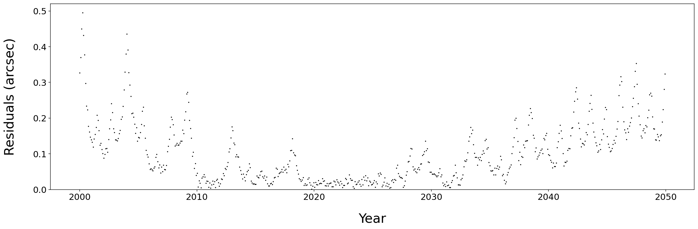

[](https://www.python.org/downloads/release/python-360/)
[](https://pypi.python.org/pypi/spacerocks/)
[](https://www.gnu.org/licenses/gpl-3.0)
[](https://spacerocks.readthedocs.io/en/latest/?badge=latest)
[](https://codecov.io/gh/kjnapier/spacerocks)

`spacerocks` is a Python package that puts the solar system at your fingertips. 
It provides high-level abstractions 
for orbital dynamics and solar system observations. Its modern, 
expressive API makes it extremely easy to define orbits, work 
with multiple objects (bound or unbound), transform coordinates, 
numerically propagate orbits, and compute precise ephemerides. 
There is support for arbitrary rotation curves, and much more. 

The most computationally expensive tasks are written in C and wrapped with Python.
Under the hood, the code uses [rebound](https://github.com/hannorein/rebound) 
for numerical integration and [spiceypy](https://github.com/AndrewAnnex/SpiceyPy) 
for reading spice files, making the computations fast and the results robust. 

Here we illustrate the accuracy of the calculations by comparing 
our predicted ephemerides of Ceres to those generated by JPL Horizons 
for a 50 year timespan. The calculation takes only a few lines 
of code in `spacerocks`.

```Python
from spacerocks import SpaceRock, Units
from astropy.time import Time
import numpy as np

rock = SpaceRock.from_horizons(name='Ceres')

startdate = Time('2000-01-01', scale='utc', format='iso')
enddate   = Time('2050-01-01', scale='utc', format='iso')
testdates = Time(np.arange(startdate.jd, enddate.jd, 30), scale='utc', format='jd')

units = Units()
units.timescale = 'utc'
prop, planets, sim = rock.propagate(epochs=testdates.jd, model='PLANETS', units=units)
obs = prop.observe(obscode='W84')
```


The `spacerocks` prediction never differs from the JPL Horizons prediction by more than half an arcsecond.

Several common use cases are illustrated in [tutorial notebooks](./notebooks/). One that I find rather useful is a subclass of `rebound's`
`Simulation` class. See a short tutorial [here](./notebooks/Simulation.ipynb). For more information, see [the documentation](./docs/). The [SpaceRock](./docs/SpaceRock.md) doc is a good place to start.

### Installation

The easiest way to install spacerocks is with pip:

```zsh
pip install spacerocks
```

If you want to be sure that you have the most up-to-date version, you can clone the repository and install from the source.

```zsh
git clone https://github.com/kjnapier/spacerocks.git
cd spacerocks
python setup.py build_ext -i
pip install .
```

You'll also need `OpenMP` and `swig`. On MacOS, you can install these with `brew`

```zsh
brew install libomp
brew install swig
```
